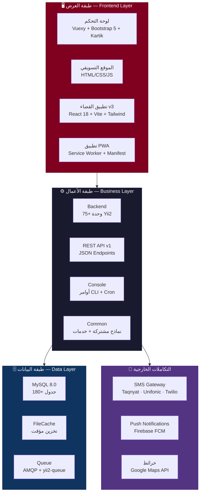
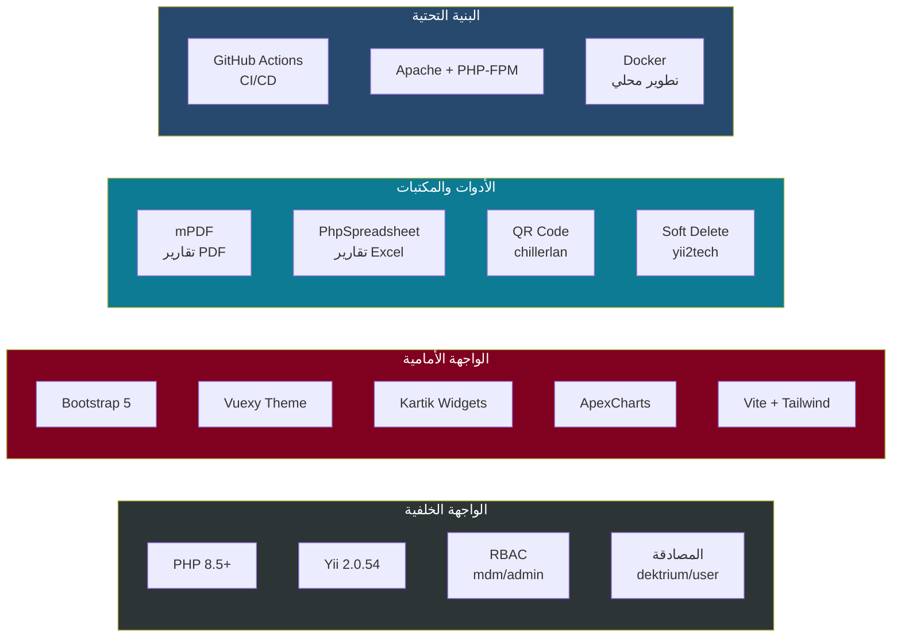
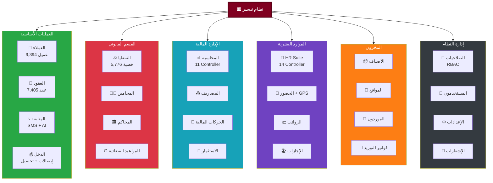
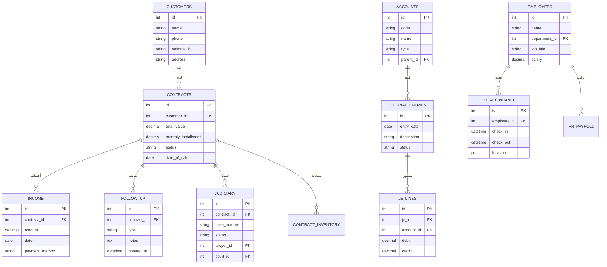
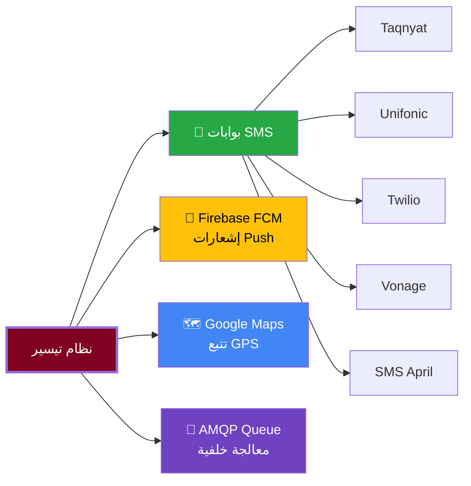
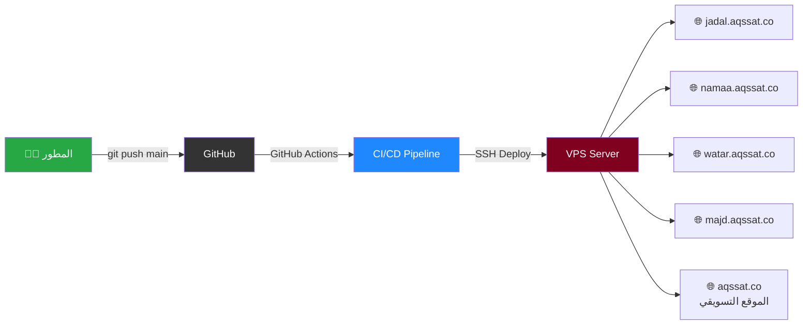

<div align="center">

# نظام تيسير لإدارة شركات التقسيط

### Tayseer ERP — Enterprise Installment Management System

<br>


<br>

**منصة متكاملة لإدارة عمليات شركات التقسيط والتمويل**
**تغطي دورة حياة العقد بالكامل — من تسجيل العميل حتى التحصيل والقضاء**

<br>

[الميزات](#-الميزات-الرئيسية) · [البنية](#-البنية-التقنية) · [الأقسام](#-أقسام-النظام) · [التثبيت](#-التثبيت-والتشغيل) · [API](#-واجهة-برمجة-التطبيقات-rest-api) · [النشر](#-النشر-والتوزيع)

</div>

---

## 📊 النظام بالأرقام

<div align="center">

| المقياس | العدد |
|:-------:|:-----:|
| **ملفات PHP** | **1,932** |
| **ملفات JavaScript** | **114** |
| **ملفات CSS** | **130** |
| **وحدات النظام (Modules)** | **75+** |
| **Controllers** | **113** |
| **Models** | **240** |
| **واجهات العرض (Views)** | **737** |
| **جداول قاعدة البيانات** | **180+** |
| **ملفات الترحيل (Migrations)** | **242** |
| **شاشات النظام** | **479** |
| **نماذج إدخال** | **163** |

</div>

---

## 🏗 البنية التقنية

```
نظام تيسير مبني على معمارية متعددة الطبقات (Multi-Tier Architecture)
يعمل على إطار Yii2 Advanced مع فصل كامل بين الطبقات
```

### مخطط البنية العام



### الحزمة التقنية الكاملة



---

## 🎯 الميزات الرئيسية

### إدارة العملاء والعقود
- ✅ تسجيل ذكي للعملاء مع نموذج متعدد الخطوات (Wizard)
- ✅ التحقق التلقائي من التكرار والمخاطر
- ✅ رفع المستندات والصور مع معالجة OCR
- ✅ إدارة كاملة لعقود التقسيط بجميع حالاتها
- ✅ جدولة الأقساط التلقائية مع نظام مرن للسداد
- ✅ ربط المنتجات والأرقام التسلسلية بالعقود

### المتابعة والتحصيل
- ✅ لوحة متابعة شاملة لكل عقد (Panel)
- ✅ نظام SMS متعدد المزودين (Taqnyat, Unifonic, Twilio, Vonage)
- ✅ كشوف حساب تفاعلية مع التحقق
- ✅ مسودات رسائل SMS مع قوالب ذكية
- ✅ تقارير متابعة بدون تواصل
- ✅ ذكاء اصطناعي مساعد للمتابعة (AI Feedback)

### القسم القانوني والقضاء
- ✅ إدارة كاملة للقضايا القانونية
- ✅ نظام مواعيد قضائية مع تنبيهات تلقائية
- ✅ إدارة المحامين والمحاكم والجهات
- ✅ قوالب طلبات قانونية
- ✅ عمليات دفعية (Batch) لإنشاء وتنفيذ القضايا
- ✅ أصول محجوزة وتتبع التكاليف
- ✅ **تطبيق قضاء مستقل (v3)** — React + Node.js

### المحاسبة والإدارة المالية
- ✅ شجرة حسابات كاملة (Chart of Accounts)
- ✅ قيود يومية تلقائية ويدوية
- ✅ الأستاذ العام (General Ledger)
- ✅ ذمم مدينة ودائنة (AR/AP)
- ✅ موازنات وسنوات مالية
- ✅ مراكز تكلفة
- ✅ تقارير مالية شاملة (ميزان مراجعة، قائمة دخل، ميزانية)
- ✅ تحليل ذكي بالذكاء الاصطناعي (AI Insights)
- ✅ نظام صناديق نقدية موحد

### الموارد البشرية
- ✅ سجل موظفين شامل مع ملفات رقمية
- ✅ نظام حضور وانصراف مع تتبع GPS
- ✅ مناطق عمل جغرافية (Geofencing)
- ✅ إدارة رواتب ومسيّرات
- ✅ نظام إجازات كامل مع سياسات متعددة
- ✅ تقييمات أداء دورية
- ✅ سلف وقروض موظفين
- ✅ ورديات عمل مرنة
- ✅ لوحة تحكم HR متكاملة

### إدارة المخزون
- ✅ كتالوج أصناف مع أرقام تسلسلية
- ✅ مواقع تخزين متعددة
- ✅ فواتير توريد مع معالج خطوات (Wizard)
- ✅ تتبع حركة المخزون ورصيد كل صنف
- ✅ إدارة موردين
- ✅ ربط المخزون بالعقود

### إدارة الاستثمار
- ✅ إدارة المساهمين ورأس المال
- ✅ حركات رأس المال (إيداع / سحب)
- ✅ توزيع أرباح تلقائي
- ✅ مصاريف مشتركة وتخصيصها
- ✅ سجل أسهم

### الديوان والمراسلات
- ✅ إدارة المعاملات الرسمية
- ✅ تتبع المراسلات الواردة والصادرة
- ✅ أرشفة إلكترونية

---

## 📦 أقسام النظام

### المخطط الهيكلي للوحدات



### تفصيل الوحدات (75+ وحدة)

<details>
<summary><strong>🟢 العمليات الأساسية (Core Business) — 14 وحدة</strong></summary>

| الوحدة | الوصف | Controllers | ملاحظات |
|:------:|:-----:|:-----------:|:-------:|
| `customers` | إدارة بيانات العملاء، النماذج الذكية، الوسائط | 2 | بحث مقترح، فحص التكرار، التصدير |
| `contracts` | عقود التقسيط، العرض القانوني، ربط المخزون | 1 | +1500 سطر، سير عمل الحالات |
| `contractInstallment` | أقساط العقود والإيصالات | 1 | التحقق من الإيصالات |
| `contractDocumentFile` | مستندات ومرفقات العقود | 1 | |
| `collection` | التحصيل | 1 | |
| `financialTransaction` | الحركات المالية والاستيراد | 1 | استيراد بيانات |
| `income` | الدخل وجدول الأقساط | 1 | |
| `incomeCategory` | تصنيفات الدخل | 1 | |
| `expenses` | المصاريف | 1 | |
| `expenseCategories` | تصنيفات المصاريف | 1 | استيراد مدعوم |
| `invoice` | الفوترة | 1 | |
| `paymentType` | أنواع الدفع | 1 | |
| `bancks` | البنوك | 1 | |
| `companyBanks` | حسابات الشركة البنكية | 2 | |

</details>

<details>
<summary><strong>🔴 القسم القانوني والقضاء — 14 وحدة</strong></summary>

| الوحدة | الوصف | Controllers | ملاحظات |
|:------:|:-----:|:-----------:|:-------:|
| `judiciary` | إدارة القضايا الشاملة | 1 | Controller ضخم: تقارير، تبويبات، تصدير، مراسلات، مواعيد، عمليات دفعية |
| `judiciaryType` | أنواع القضايا | 1 | |
| `judiciaryAuthorities` | الجهات القضائية | 1 | |
| `judiciaryRequestTemplates` | قوالب الطلبات | 1 | |
| `judiciaryActions` | أنواع الإجراءات | 2 | |
| `judiciaryCustomersActions` | إجراءات قضائية للعملاء | 2 | |
| `JudiciaryInformAddress` | عناوين التبليغ | 1 | |
| `lawyers` | المحامون | 1 | |
| `LawyersImage` | صور المحامين | 1 | |
| `court` | المحاكم | 2 | |
| `documentHolder` | حافظ المستندات | 1 | |
| `documentStatus` | حالات المستندات | 1 | |
| `documentType` | أنواع المستندات | 1 | |
| `realEstate` | العقارات | — | نماذج وعروض فقط |

</details>

<details>
<summary><strong>🔵 المحاسبة والإدارة المالية — 11 Controller</strong></summary>

| Controller | الوصف |
|:----------:|:-----:|
| `Default` | لوحة المحاسبة الرئيسية |
| `ChartOfAccounts` | شجرة الحسابات |
| `CostCenter` | مراكز التكلفة |
| `FiscalYear` | السنوات المالية والفترات |
| `JournalEntry` | القيود اليومية |
| `GeneralLedger` | الأستاذ العام |
| `AccountsPayable` | الذمم الدائنة |
| `AccountsReceivable` | الذمم المدينة |
| `Budget` | الموازنات |
| `FinancialStatements` | التقارير المالية |
| `AiInsights` | التحليل الذكي بالذكاء الاصطناعي |

</details>

<details>
<summary><strong>🟣 الموارد البشرية — 14 Controller</strong></summary>

| Controller | الوصف |
|:----------:|:-----:|
| `HrDashboard` | لوحة تحكم HR |
| `HrEmployee` | سجل الموظفين |
| `HrAttendance` | الحضور والانصراف |
| `HrPayroll` | الرواتب والمسيرات |
| `HrField` | العمليات الميدانية |
| `HrEvaluation` | تقييمات الأداء |
| `HrLoan` | السلف والقروض |
| `HrLeave` | الإجازات |
| `HrShift` | الورديات |
| `HrWorkZone` | مناطق العمل الجغرافية |
| `HrTrackingApi` | واجهة تتبع GPS |
| `HrTrackingReport` | تقارير التتبع |
| `HrReport` | التقارير العامة |

</details>

<details>
<summary><strong>🟠 المخزون — 6 وحدات</strong></summary>

| الوحدة | الوصف |
|:------:|:-----:|
| `items` | كتالوج الأصناف |
| `inventoryItems` | الأصناف المخزنية والأرقام التسلسلية |
| `inventoryItemQuantities` | الكميات حسب الموقع |
| `inventoryInvoices` | فواتير التوريد |
| `inventoryStockLocations` | مواقع التخزين |
| `inventorySuppliers` | الموردون |

</details>

<details>
<summary><strong>⚪ المتابعة والتواصل — 14 وحدة</strong></summary>

| الوحدة | الوصف |
|:------:|:-----:|
| `followUp` | المتابعة الشاملة: SMS، لوحة، AI، مهام، جدول زمني |
| `followUpReport` | تقارير المتابعة |
| `rejesterFollowUpType` | أنواع المتابعة |
| `sms` | سجل الرسائل |
| `notification` | الإشعارات الداخلية |
| `phoneNumbers` | أرقام الهواتف |
| `address` | العناوين |
| `citizen` | الجنسيات |
| `cousins` | الأقارب والكفلاء |
| `contactType` | أنواع التواصل |
| `connectionResponse` | نتائج الاتصال |
| `feelings` | مشاعر العميل |
| `hearAboutUs` | مصادر التسويق |
| `loanScheduling` | جدولة القروض |

</details>

<details>
<summary><strong>💎 الاستثمار — 5 وحدات</strong></summary>

| الوحدة | الوصف |
|:------:|:-----:|
| `shareholders` | المساهمون |
| `capitalTransactions` | حركات رأس المال |
| `profitDistribution` | توزيع الأرباح |
| `sharedExpenses` | المصاريف المشتركة |
| `shares` | سجل الأسهم |

</details>

<details>
<summary><strong>🔧 إدارة النظام والبيانات المرجعية — 15+ وحدة</strong></summary>

| الوحدة | الوصف |
|:------:|:-----:|
| `companies` | الشركات |
| `companyManagement` | إدارة وتوفير الشركات (Multi-tenant) |
| `diwan` | الديوان والمراسلات |
| `reports` | التقارير عبر الأقسام |
| `authAssignment` | إدارة الصلاحيات RBAC |
| `city` | المدن |
| `location` | المواقع |
| `branch` | الفروع |
| `status` | الحالات |
| `department` | الأقسام |
| `designation` | المسميات الوظيفية |
| `employee` | سجل الموظفين (Legacy) |
| `dektrium/user` | إدارة المستخدمين (تسجيل، استعادة، ملف شخصي) |
| `gridview` | Kartik GridView |
| `admin` | RBAC UI (mdm/admin) |

</details>

---

## 🔄 سير العمل الرئيسي


---

## 📁 هيكل المشروع

```
Tayseer/
│
├── 📂 backend/                     لوحة التحكم — التطبيق الرئيسي
│   ├── assets/                     حزم الأصول (AppAsset, PrintAsset, ...)
│   ├── components/                 مكونات مخصصة (RouteAccessBehavior, ...)
│   ├── config/                     إعدادات Backend
│   ├── controllers/                Controllers رئيسية (Site, Pin, Theme, ...)
│   ├── helpers/                    مساعدات (FlatpickrAsset, ...)
│   ├── modules/                    ← 75+ وحدة — قلب النظام
│   │   ├── accounting/             المحاسبة (11 controller)
│   │   ├── contracts/              العقود
│   │   ├── customers/              العملاء
│   │   ├── followUp/               المتابعة
│   │   ├── hr/                     الموارد البشرية (14 controller)
│   │   ├── judiciary/              القضاء
│   │   ├── inventoryItems/         المخزون
│   │   └── ...                     60+ وحدة أخرى
│   ├── views/                      قوالب العرض
│   │   ├── layouts/                القوالب الرئيسية (Vuexy theme)
│   │   └── site/                   الصفحات العامة (Dashboard, Error)
│   └── web/                        الملفات العامة
│       ├── css/                    أنماط مخصصة + Design Tokens + Component Library
│       ├── js/                     سكربتات مخصصة (30+ ملف)
│       ├── vuexy/                  ثيم Vuexy الكامل
│       ├── plugins/                إضافات (Select2, Flatpickr, ...)
│       ├── manifest.json           PWA Manifest
│       └── sw.js                   Service Worker
│
├── 📂 api/                         REST API — واجهة برمجية
│   ├── config/                     إعدادات API
│   ├── helpers/                    مساعدات (Auth, FCM, SMS, ...)
│   └── modules/v1/                 الإصدار الأول
│       └── controllers/            Payments, Users, CustomerImages
│
├── 📂 common/                      الكود المشترك
│   ├── config/                     إعدادات عامة (DB, params, SMS, ...)
│   ├── models/                     نماذج مشتركة (User, SystemSettings, ...)
│   ├── services/                   خدمات (NotificationService)
│   ├── helper/                     مساعدات (SMSHelper, Permissions, ...)
│   └── components/                 مكونات مشتركة
│
├── 📂 console/                     أوامر CLI
│   ├── controllers/                أوامر Console (Deadline, ...)
│   └── migrations/                 242 ملف ترحيل قاعدة البيانات
│
├── 📂 frontend/                    الواجهة العامة (تسجيل دخول، تواصل)
│
├── 📂 judiciary-v3/                تطبيق القضاء المستقل
│   ├── server/                     Node.js Express API
│   └── client/                     React 18 + Vite + Tailwind
│
├── 📂 landing/                     الموقع التسويقي (HTML/CSS/JS)
│
├── 📂 docs/                        التوثيق
│   ├── setup-guide.md              دليل التثبيت
│   ├── HR_MODULE_SPECIFICATION.md  مواصفات الموارد البشرية
│   ├── specs/                      مواصفات تقنية
│   └── reports/                    تقارير هندسة عكسية (479 شاشة)
│
├── 📂 database/                    أصول قاعدة البيانات
│   ├── migrations/                 سكربتات ترحيل عن بُعد
│   ├── seeds/                      بيانات اختبارية
│   └── sql/                        عروض SQL ونصوص
│
├── 📂 scripts/                     أدوات تشغيل (Python)
│   ├── deploy/                     سكربتات النشر
│   ├── fix/                        إصلاحات وتصحيحات
│   └── verify/                     فحوصات ما بعد النشر
│
├── 📂 deploy/                      البنية التحتية
│   ├── docker-legacy/              Docker Compose (تطوير)
│   └── sshfs/                      أدوات SFTP
│
├── 📂 .github/workflows/          CI/CD — GitHub Actions
│   └── deploy.yml                  نشر تلقائي لـ 4 مواقع
│
├── 📂 .cursor/                     إعدادات IDE
│   ├── rules/                      قواعد المشروع
│   └── skills/                     مهارات مخصصة (5 مهارات)
│
├── composer.json                   اعتماديات PHP
├── phpstan.neon                    تحليل ثابت PHPStan
├── vite.config.js                  إعدادات Vite
└── README.md                       هذا الملف
```

---

## 🗄️ قاعدة البيانات

### نموذج البيانات الرئيسي



### الجداول الرئيسية (180+)

| المجموعة | الجداول | أمثلة |
|:---------:|:-------:|:-----:|
| **الهوية والصلاحيات** | 10+ | `user`, `profile`, `auth_item`, `auth_assignment`, `system_settings` |
| **العملاء والعقود** | 15+ | `customers`, `contracts`, `contract_document_file`, `Income`, `collection` |
| **المتابعة** | 8+ | `follow_up`, `follow_up_connection_reports`, `sms`, `sms_drafts`, `notification` |
| **القضاء** | 15+ | `judiciary`, `judiciary_actions`, `judiciary_deadlines`, `judiciary_seized_assets`, `court`, `lawyers` |
| **المحاسبة** | 12+ | `accounts`, `journal_entries`, `journal_entry_lines`, `fiscal_years`, `budgets`, `receivables` |
| **المخزون** | 8+ | `inventory_items`, `inventory_item_quantities`, `inventory_stock_locations`, `inventory_invoices` |
| **الموارد البشرية** | 15+ | `hr_attendance`, `hr_attendance_log`, `hr_work_zone`, `hr_geofence_event`, `hr_tracking_point` |
| **الاستثمار** | 6+ | `shareholders`, `capital_transactions`, `profit_distributions`, `shared_expense_allocations` |
| **البيانات المرجعية** | 20+ | `companies`, `branch`, `department`, `city`, `location`, `bancks`, `jobs` |

### عروض SQL (Database Views)

- `vw_hr_attendance_daily_summary` — ملخص الحضور اليومي
- `vw_hr_employee_directory` — دليل الموظفين
- `vw_payroll_employee_attendance` — حضور الرواتب
- `vw_contracts_overview` — نظرة عامة على العقود
- `vw_inventory_item_balance` — أرصدة المخزون
- `vw_judiciary_actions_feed` — تغذية الإجراءات القضائية
- `v_deadline_live` — المواعيد القضائية الحية

---

## 🌐 واجهة برمجة التطبيقات (REST API)

```
Base URL: /api/v1/
Format: JSON Only
Auth: Token-based (ApiAccessRule + Authenticator)
```

| Endpoint | Method | الوصف |
|:--------:|:------:|:-----:|
| `/v1/users` | GET | قائمة المستخدمين |
| `/v1/users` | POST | إنشاء مستخدم |
| `/v1/payments/contract-enquiry` | POST | استعلام عقد |
| `/v1/payments/flat-contract-enquiry` | POST | استعلام عقد (مبسط) |
| `/v1/payments/new-payment` | POST | تسجيل دفعة جديدة |
| `/v1/payments/flat-new-payment` | POST | تسجيل دفعة (مبسط) |
| `/v1/customer-images` | GET | صور العميل |

---

## 🔌 التكاملات الخارجية



---

## 🚀 التثبيت والتشغيل

### المتطلبات

| المتطلب | الإصدار |
|:-------:|:-------:|
| PHP | 8.5+ |
| MySQL | 8.0+ |
| Composer | 2.x |
| Node.js | 18+ (لتطبيق القضاء v3) |
| Apache/Nginx | أي إصدار حديث |

### خطوات التثبيت

```bash
# 1. استنساخ المستودع
git clone https://github.com/EngOsamaQazan/Tayseer.git
cd Tayseer

# 2. تثبيت الاعتماديات
composer install

# 3. تهيئة البيئة
php init            # Linux/Mac
init.bat            # Windows

# 4. إعداد قاعدة البيانات
# عدّل common/config/main-local.php بإعدادات DB الخاصة بك

# 5. تشغيل الترحيلات
php yii migrate

# 6. تشغيل الخادم
php yii serve
```

### إعداد تطبيق القضاء v3

```bash
cd judiciary-v3

# تثبيت جميع الاعتماديات
npm run install:all

# إعداد البيئة
cp .env.example .env
# عدّل .env بإعدادات DB

# تشغيل التطوير
npm run dev
# API: http://localhost:3001
# Client: http://localhost:5173
```

> للحصول على دليل تفصيلي كامل، راجع [`docs/setup-guide.md`](docs/setup-guide.md)

---

## 📤 النشر والتوزيع

### النشر التلقائي (CI/CD)



**مراحل النشر التلقائي:**
1. `git push` إلى فرع `main` يُفعّل GitHub Actions
2. الاتصال بالخادم عبر SSH
3. سحب آخر التحديثات لكل موقع
4. نسخ إعدادات البيئة الخاصة بكل موقع
5. تثبيت الاعتماديات (`composer install --no-dev`)
6. تشغيل الترحيلات (`php yii migrate/up`)
7. مسح ذاكرة التخزين المؤقت
8. إعادة تشغيل الخدمات

### البيئات المتعددة (Multi-tenant)

| البيئة | المسار | الاستخدام |
|:------:|:------:|:---------:|
| `prod_jadal` | `/var/www/jadal.aqssat.co` | شركة جدل |
| `prod_namaa` | `/var/www/namaa.aqssat.co` | شركة نماء |
| `prod_watar` | `/var/www/watar.aqssat.co` | شركة وتر |
| `prod_majd` | `/var/www/majd.aqssat.co` | شركة مجد |

---

## ♿ إمكانية الوصول والجودة

### المعايير المطبقة

| المعيار | المستوى | التفاصيل |
|:-------:|:-------:|:--------:|
| **WCAG 2.2** | AAA | تباين 7:1، أهداف لمس 44px، مخطط تركيز واضح |
| **ISO 9241-110** | ✅ | مبادئ التفاعل |
| **ISO 9241-125** | ✅ | العرض المرئي |
| **ISO 9241-171** | ✅ | إمكانية الوصول |
| **Nielsen's Heuristics** | ✅ | 10 قواعد قابلية الاستخدام |

### ميزات إمكانية الوصول
- رابط "انتقل للمحتوى الرئيسي" (Skip to Content)
- هرمية عناوين صحيحة (`<h1>` → `<h6>`)
- سمات ARIA على القائمة الجانبية والتبويبات والنوافذ
- اختصارات لوحة مفاتيح مع لوحة مساعدة (`?`)
- دعم كامل لقارئات الشاشة
- وضع تقليل الحركة (`prefers-reduced-motion`)

---

## 📱 تطبيق الويب التقدمي (PWA)

- تثبيت كتطبيق على الهاتف والحاسوب
- عمل بدون اتصال (Offline-first) عبر Service Worker
- واجهة عربية كاملة مع دعم RTL
- أيقونة قابلة للتخصيص (Maskable Icon)

---

## 📚 التوثيق

| المستند | الرابط | الوصف |
|:-------:|:------:|:-----:|
| دليل التثبيت | [`docs/setup-guide.md`](docs/setup-guide.md) | إعداد بيئة التطوير المحلية |
| مواصفات HR | [`docs/HR_MODULE_SPECIFICATION.md`](docs/HR_MODULE_SPECIFICATION.md) | مواصفات تقنية كاملة للموارد البشرية |
| معالج الفواتير | [`docs/invoice-wizard-and-approval-flow.md`](docs/invoice-wizard-and-approval-flow.md) | تصميم معالج التوريد والموافقات |
| تصميم القضاء | [`docs/specs/JUDICIARY_REDESIGN_PROMPT.md`](docs/specs/JUDICIARY_REDESIGN_PROMPT.md) | مخطط تطبيق القضاء v3 |
| Design Tokens | [`backend/web/css/DESIGN-TOKENS.md`](backend/web/css/DESIGN-TOKENS.md) | مرجع متغيرات CSS |
| مكتبة المكونات | [`backend/web/css/COMPONENT-LIBRARY.md`](backend/web/css/COMPONENT-LIBRARY.md) | مرجع مكونات الواجهة |
| تقرير هندسة عكسية | [`docs/reports/`](docs/reports/) | تحليل 479 شاشة و77 وحدة |

---

## 🛡️ الأمان والصلاحيات

- **نظام RBAC كامل** — أدوار وصلاحيات دقيقة عبر `mdm/admin`
- **مصادقة متقدمة** — تسجيل، استعادة كلمة مرور، ملفات شخصية عبر `dektrium/user`
- **التحكم بالوصول** — `RouteAccessBehavior` على مستوى المسارات
- **تشفير الإعدادات الحساسة** — `SystemSettings` مع تشفير القيم
- **Soft Delete** — حذف ناعم للبيانات الحساسة
- **نظام PIN** — قفل إضافي للعمليات الحساسة

---

## 🧪 ضمان الجودة

- **PHPStan Level 3** — تحليل ثابت للكود
- **Codeception** — اختبارات وحدة وتكامل
- **GitHub Actions** — نشر تلقائي مع فحوصات

---

<div align="center">

## 📄 الترخيص

مرخص بموجب [BSD License](LICENSE.md)

---

**نظام تيسير** — صُمم وطُوّر لتلبية احتياجات شركات التقسيط والتمويل في المنطقة العربية

<br>


</div>
